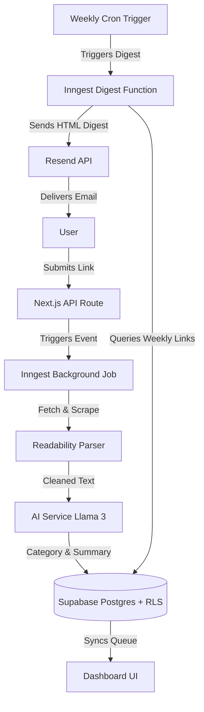

# Read It Anytime

Stop losing links you meant to read. Save links, get AI-summarized insights, and receive a clean weekly email digest.

## Overview

**Read It Anytime** is a personal reading companion designed for developers and researchers who want to keep up with saved links without the anxiety of a growing bookmarks backlog. Users submit links to their dashboard, where a background scraping engine extracts the main content and an AI engine categorizes and summarizes the articles. Every week, the system compiles these summaries into a clean, distraction-free email digest sent directly to their inbox.

## Features

- **Google OAuth Sign-in**: Secure login using Google authentication via Supabase Auth.
- **Link Saving with SSRF-Protected Scraping**: Paste links securely; internal DNS lookup and IP checks prevent Server-Side Request Forgery.
- **AI Categorization & Summarization**: Automatic extraction of readable text parsed into structured summaries and categorizations.
- **Search/Filter/Sort Dashboard**: Dynamic user interface to organize and search articles by tags, read state, and text.
- **Archive & Mark-as-Read**: Easy queue management by marking links as read or archiving them.
- **Weekly Digest Email**: Background automated emails compiling weekly bookmarks into structured reading digests.
- **Per-User Rate Limiting & Usage Caps**: Dynamic limits to restrict the number of processed links and API requests per user.

## Tech Stack

- **Frontend**: Next.js 16, TypeScript, Tailwind CSS v4, React 19
- **Backend**: Next.js API routes, Prisma Client, `@mozilla/readability`
- **Database & Auth**: Supabase Postgres (with Row-Level Security (RLS) policies), Supabase Auth
- **Background Jobs**: Inngest (Event-driven workflows & serverless crons)
- **Email**: Resend (Transactional emails and weekly digest delivery)
- **Rate Limiting**: Upstash Redis (REST-based API rate limiter)
- **Error Tracking**: Sentry (Application-wide error monitoring)

## Architecture

When a user submits a link in the dashboard, a Next.js API route validates the URL and publishes an event to Inngest. An asynchronous Inngest job picks up the task, performs an SSRF-safe fetch, extracts clean article text using Readability, and sends it to the AI service to produce a categorization and concise summary. A separate weekly cron job in Inngest executes every Monday, aggregates each user's unread links saved over the past week, compiles them into a structured HTML digest, and emails it to the user using Resend.



## Getting Started (Local Setup)

### Prerequisites

- **Node.js**: v20 or higher
- **Package Manager**: `npm` or `bun`

### Installation

1. Clone the repository:
   ```bash
   git clone https://github.com/ManasParauha/read-it-anytime.git
   cd read-it-anytime
   ```

2. Install dependencies:
   ```bash
   npm install
   # or
   bun install
   ```

### Local Environment Configuration

Create a `.env.local` file in the root directory by copying `.env.example`:
```bash
cp .env.example .env.local
```

Configure the required variables in `.env.local`:

| Variable | Scope | Description |
| :--- | :--- | :--- |
| `DATABASE_URL` | Server | Transaction-pooled database connection string for Supabase Postgres (port 6543) |
| `DIRECT_URL` | Server | Direct database connection string for Prisma migrations (port 5432) |
| `NEXT_PUBLIC_SUPABASE_URL` | Client | Supabase project URL endpoint (client-safe) |
| `NEXT_PUBLIC_SUPABASE_ANON_KEY` | Client | Supabase public anonymous key (client-safe) |
| `SUPABASE_SERVICE_ROLE_KEY` | Server | Supabase admin service role key to bypass RLS policies on the server |
| `GOOGLE_CLIENT_ID` | Server/Supabase | Google Cloud Console OAuth Client ID |
| `GOOGLE_CLIENT_SECRET` | Server/Supabase | Google Cloud Console OAuth Client Secret |
| `AI_API_KEY` | Server | API Key for the AI service provider (Groq/Llama 3) |
| `RESEND_API_KEY` | Server | Resend API key for sending digest emails |
| `INNGEST_EVENT_KEY` | Server | Signing key used for sending events to the Inngest engine |
| `INNGEST_SIGNING_KEY` | Server | Inngest app signing key for verifying incoming SDK webhook calls |
| `INNGEST_DEV` | Server | Boolean flag (`1` for local dev server, `0` for production) |
| `UPSTASH_REDIS_REST_URL` | Server | Upstash Redis REST URL for rate limiting and usage counters |
| `UPSTASH_REDIS_REST_TOKEN` | Server | Upstash Redis REST token for rate limiting authentication |
| `SENTRY_DSN` | Server | Sentry DSN for server/edge error monitoring |
| `NEXT_PUBLIC_SENTRY_DSN` | Client | Sentry DSN for client/browser error monitoring |
| `SENTRY_AUTH_TOKEN` | Server | Sentry token used during the build phase to upload source maps |

### Database Migrations

Run the local migration command to initialize tables on your development database:
```bash
npx prisma migrate dev
# or
bunx prisma migrate dev
```

### Run the Application

Start the Next.js development server:
```bash
npm run dev
# or
bun dev
```

The application will be running at [http://localhost:3000](http://localhost:3000).

*Note: For local background job development, make sure to start the Inngest dev server by running `npx inngest-cli dev`.*

## Deployment

For step-by-step instructions on deploying the database, running migrations on the remote server, configuring environment variables in production, and setting up Inngest Cloud, see [DEPLOYMENT.md](DEPLOYMENT.md).

## Security Notes

Security and data privacy are enforced at every tier of the application. Key mechanisms include:
- **SSRF Protection**: An IP/hostname blocklist checks resolved DNS addresses before scraping external links to prevent Server-Side Request Forgery.
- **RLS-Enforced Multi-Tenancy**: Postgres Row-Level Security policies ensure users can only access their own profile, saved links, usage statistics, and digests.
- **Per-User Rate Limits & Usage Caps**: Dynamic rate limiting on API endpoints and Inngest job queues prevents database overload and resource abuse.

For a comprehensive security checklist, configuration verification, and RLS policies breakdown, see [SECURITY.md](SECURITY.md).

## License

Distributed under the MIT License. See [LICENSE](LICENSE) for details.

## Author

Made by **Manas Parauha**
- [GitHub](https://github.com/ManasParauha)
- [LinkedIn](https://www.linkedin.com/in/manas-parauha-61b44031a)
